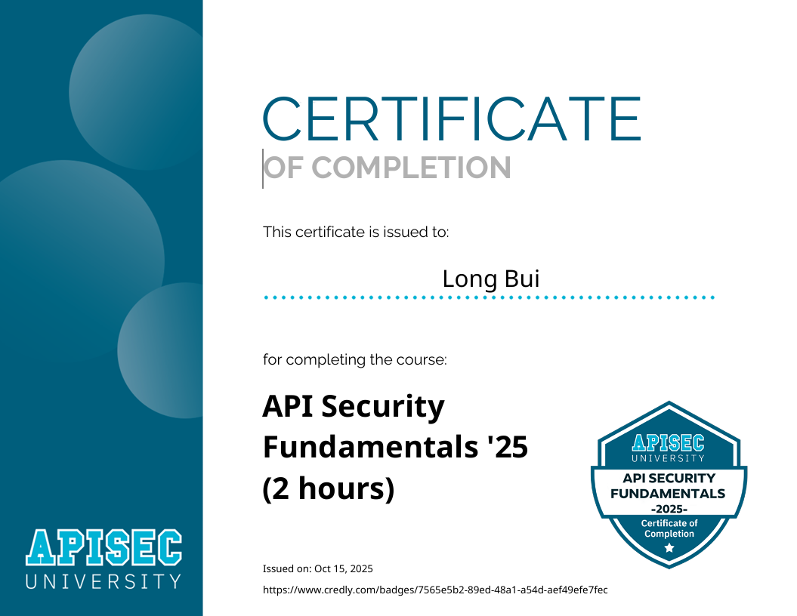

The course provides excellent material for understanding various concepts in API security. I completed it in about three days, so it’s a great option for anyone looking to quickly gain valuable knowledge or add a relevant certification to their CV or résumé.

At the beginning, the course introduces the **`OWASP Top 10 API Security 2023`**, explaining each type of API vulnerability with real-world examples and practical mitigation techniques. It also covers **threat modeling**, helping you understand how to assess and prioritize potential risks when developing or managing APIs.

Completing every single module, there is a quiz for you to check or review the knowledge for the entire lesson, which really makes me interested!!!

By the end of the course, you’ll learn effective methods to **protect, detect, and monitor** API security throughout the entire lifecycle—from design and selection to deployment and maintenance.

Overall, it’s a concise and informative course that builds a strong foundation in API security best practices.

Hope this one gains you a quick review of the course !!!

Here is my cert, it look so cool !!!! <3

 