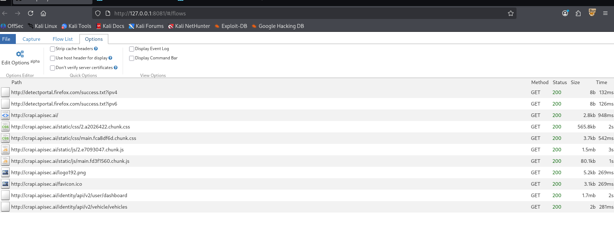
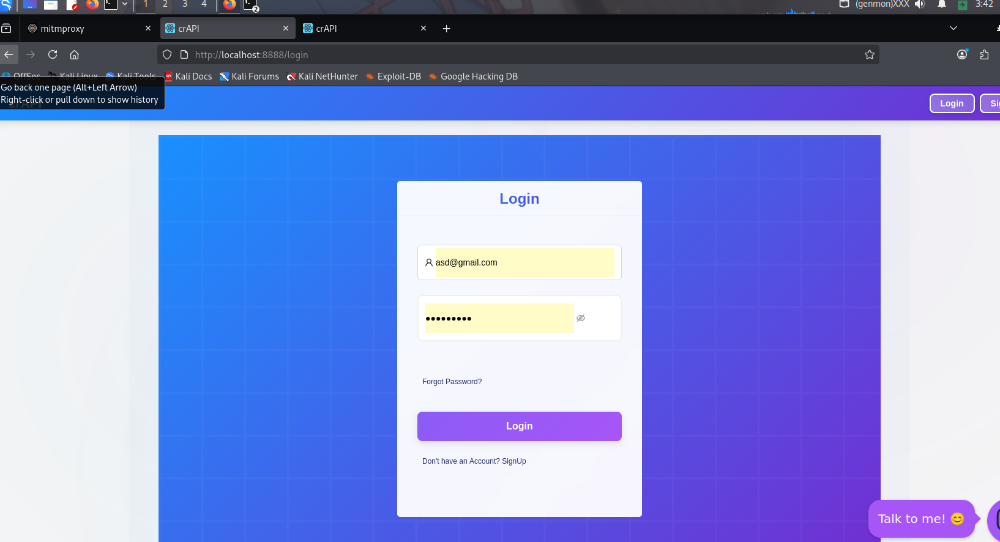
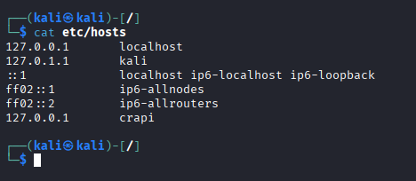

# Got problem with proxy when connecting to [localhost](http://localhost) ip or 127.0.0.1.

Recently i have been using proxy tool like postman, mitmproxy and burpsuite with foxyproxy. But the problem is those can not capture any packets from my local application 

Here is the picture of mitmweb proxy running on port 8080.

I have practiced with crAPI — here is my local web:

# So here is the solution that help me out this !

I go to etc/hosts and add the one with 127.0.0.0 with the domain name crapi.

So why is it work?

Well in my opinion, It would be there are two ip is assigned with domain name [localhost](http://localhost) or some browsers have function that skip localhost like ( bypass proxy). So when u have a domain name for that loopback ip It can not bypass that anymoreS